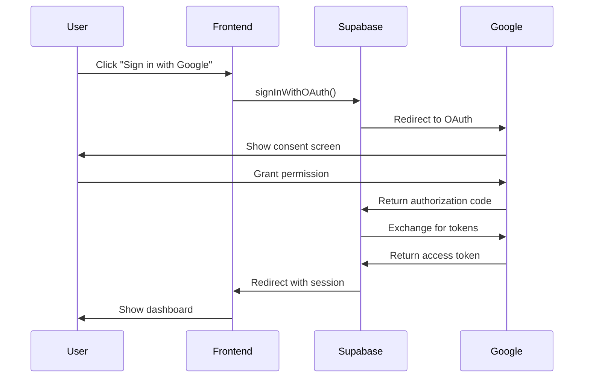
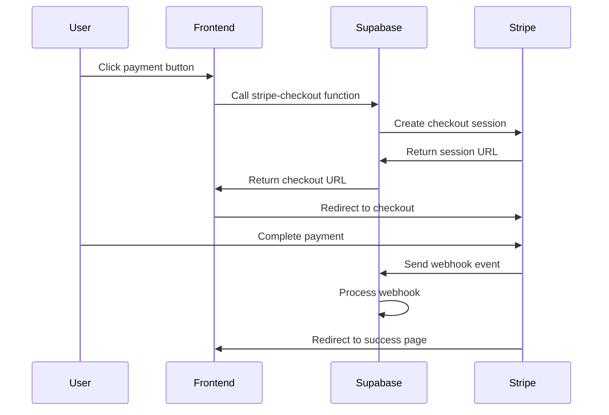

# Architecture Documentation

This document describes the technical architecture and design decisions for ScoreSweep.

## Table of Contents

- [System Overview](#system-overview)
- [Frontend Architecture](#frontend-architecture)
- [Backend Architecture](#backend-architecture)
- [Database Design](#database-design)
- [Authentication Flow](#authentication-flow)
- [Payment Processing](#payment-processing)
- [Security Architecture](#security-architecture)
- [Performance Considerations](#performance-considerations)
- [Scalability](#scalability)

## System Overview

ScoreSweep is a modern web application built with a serverless architecture, focusing on security, performance, and user experience.

### High-Level Architecture

```
┌─────────────────┐    ┌─────────────────┐    ┌─────────────────┐
│   Frontend      │    │   Supabase      │    │   Stripe        │
│   (React/Vite)  │◄──►│   (Backend)     │◄──►│   (Payments)    │
│                 │    │                 │    │                 │
│ • React 18      │    │ • PostgreSQL    │    │ • Checkout      │
│ • TypeScript    │    │ • Auth          │    │ • Webhooks      │
│ • Tailwind CSS  │    │ • Edge Functions│    │ • Subscriptions │
│ • Framer Motion │    │ • Storage       │    │                 │
└─────────────────┘    └─────────────────┘    └─────────────────┘
         │                       │                       │
         │                       │                       │
         ▼                       ▼                       ▼
┌─────────────────┐    ┌─────────────────┐    ┌─────────────────┐
│   Netlify       │    │   Row Level     │    │   Webhook       │
│   (Hosting)     │    │   Security      │    │   Processing    │
│                 │    │                 │    │                 │
│ • CDN           │    │ • User Isolation│    │ • Event Sync    │
│ • SSL           │    │ • Data Privacy  │    │ • Order Tracking│
│ • Redirects     │    │ • Access Control│    │                 │
└─────────────────┘    └─────────────────┘    └─────────────────┘
```

### Technology Stack

#### Frontend
- **React 18** - UI framework with concurrent features
- **TypeScript** - Type safety and developer experience
- **Vite** - Fast build tool and development server
- **Tailwind CSS** - Utility-first CSS framework
- **Framer Motion** - Animation library
- **Lucide React** - Icon library

#### Backend
- **Supabase** - Backend-as-a-Service platform
- **PostgreSQL** - Primary database
- **Edge Functions** - Serverless compute (Deno runtime)
- **Supabase Auth** - Authentication service

#### External Services
- **Stripe** - Payment processing
- **Netlify** - Static site hosting and CDN

## Frontend Architecture

### Component Structure

```
src/
├── components/          # Reusable UI components
│   ├── Breadcrumbs.tsx     # Navigation breadcrumbs
│   ├── DashboardLayout.tsx # Layout wrapper
│   ├── ErrorBoundary.tsx   # Error handling
│   ├── LoadingSpinner.tsx  # Loading states
│   ├── ProtectedRoute.tsx  # Route protection
│   └── ...
├── contexts/           # React Context providers
│   └── AuthContext.tsx     # Authentication state
├── hooks/             # Custom React hooks
│   ├── useStripe.ts        # Stripe integration
│   └── useSubscription.ts  # Subscription management
├── pages/             # Page-level components
│   ├── audit/             # Audit workflow pages
│   ├── dashboard/         # Dashboard pages
│   └── ...
├── data/              # Data models and mock data
├── lib/               # Utility functions
└── App.tsx           # Root component
```

### State Management

#### Context-Based State
- **AuthContext** - User authentication state
- **Local State** - Component-specific state with useState/useReducer

#### Data Fetching
- **Supabase Client** - Real-time database queries
- **Custom Hooks** - Encapsulated data fetching logic

### Routing

```typescript
// App.tsx - Route configuration
<Routes>
  <Route path="/" element={<LandingPage />} />
  <Route path="/login" element={<LoginPage />} />
  <Route path="/signup" element={<SignupPage />} />
  <Route path="/dashboard" element={
    <ProtectedRoute>
      <Dashboard />
    </ProtectedRoute>
  } />
  <Route path="/audit/new" element={
    <ProtectedRoute>
      <EnhancedAuditWizard />
    </ProtectedRoute>
  } />
</Routes>
```

### Design System

#### Typography
- **Primary Font**: Plus Jakarta Sans (body text)
- **Secondary Font**: Space Grotesk (headings)

#### Color Palette
```css
:root {
  --primary: #4C8DFF;      /* Blue */
  --accent: #5CF0B2;       /* Green */
  --dark-blue: #050D25;    /* Background */
  --mid-blue: #102B4F;     /* Secondary background */
}
```

#### Spacing System
- **Base Unit**: 8px
- **Scale**: 8px, 16px, 24px, 32px, 48px, 64px, 96px

## Backend Architecture

### Supabase Services

#### Database (PostgreSQL)
- **Primary Storage** - User data, subscriptions, orders
- **Real-time** - Live updates via WebSocket
- **Row Level Security** - Data isolation and privacy

#### Authentication
- **Multiple Providers** - Google OAuth, email/password
- **JWT Tokens** - Secure session management
- **User Metadata** - Profile information storage

#### Edge Functions (Deno Runtime)
- **stripe-checkout** - Payment session creation
- **stripe-webhook** - Payment event processing

### Database Schema

#### Core Tables

```sql
-- User authentication (managed by Supabase Auth)
auth.users (
  id uuid PRIMARY KEY,
  email text,
  created_at timestamp,
  -- ... other auth fields
)

-- Beta waitlist
beta_waitlist (
  id uuid PRIMARY KEY,
  name text NOT NULL,
  email text UNIQUE NOT NULL,
  note text,
  status text DEFAULT 'pending',
  created_at timestamptz DEFAULT now()
)

-- Stripe integration
stripe_customers (
  id bigint PRIMARY KEY,
  user_id uuid REFERENCES auth.users(id),
  customer_id text UNIQUE NOT NULL,
  created_at timestamptz,
  updated_at timestamptz,
  deleted_at timestamptz
)

stripe_subscriptions (
  id bigint PRIMARY KEY,
  customer_id text UNIQUE NOT NULL,
  subscription_id text,
  status stripe_subscription_status NOT NULL,
  -- ... other subscription fields
)

stripe_orders (
  id bigint PRIMARY KEY,
  checkout_session_id text NOT NULL,
  customer_id text NOT NULL,
  amount_total bigint NOT NULL,
  status stripe_order_status DEFAULT 'pending',
  -- ... other order fields
)
```

#### Security Views

```sql
-- Secure user subscription view
CREATE VIEW stripe_user_subscriptions AS
SELECT c.customer_id, s.subscription_id, s.status
FROM stripe_customers c
LEFT JOIN stripe_subscriptions s ON c.customer_id = s.customer_id
WHERE c.user_id = auth.uid() AND c.deleted_at IS NULL;
```

## Database Design

### Design Principles

1. **Normalization** - Minimize data redundancy
2. **Soft Deletes** - Preserve data integrity with `deleted_at` columns
3. **Audit Trail** - Track creation and modification times
4. **Foreign Key Constraints** - Maintain referential integrity

### Row Level Security (RLS)

```sql
-- Example RLS policy
CREATE POLICY "Users can view their own customer data"
  ON stripe_customers
  FOR SELECT
  TO authenticated
  USING (user_id = auth.uid() AND deleted_at IS NULL);
```

### Indexing Strategy

```sql
-- Performance indexes
CREATE INDEX idx_beta_waitlist_email ON beta_waitlist(email);
CREATE INDEX idx_beta_waitlist_created_at ON beta_waitlist(created_at DESC);
CREATE UNIQUE INDEX stripe_customers_customer_id_key ON stripe_customers(customer_id);
CREATE UNIQUE INDEX stripe_customers_user_id_key ON stripe_customers(user_id);
```

## Authentication Flow

### OAuth Flow (Google)



### Session Management

```typescript
// AuthContext.tsx
const AuthProvider = ({ children }) => {
  const [user, setUser] = useState(null);
  const [session, setSession] = useState(null);

  useEffect(() => {
    // Get initial session
    supabase.auth.getSession().then(({ data: { session } }) => {
      setSession(session);
      setUser(session?.user ?? null);
    });

    // Listen for auth changes
    const { data: { subscription } } = supabase.auth.onAuthStateChange(
      (event, session) => {
        setSession(session);
        setUser(session?.user ?? null);
      }
    );

    return () => subscription.unsubscribe();
  }, []);
};
```

### Demo Mode

```typescript
// Support for demo mode without authentication
const isDemoMode = true; // Configuration flag

if (isDemoMode) {
  // Create mock user for demo purposes
  const demoUser = {
    id: 'demo-user-id',
    email: 'demo@scoresweep.com',
    user_metadata: { full_name: 'Demo User' }
  };
  setUser(demoUser);
}
```

## Payment Processing

### Stripe Integration Architecture



### Edge Function: stripe-checkout

```typescript
// supabase/functions/stripe-checkout/index.ts
Deno.serve(async (req) => {
  const { price_id, mode, success_url, cancel_url } = await req.json();
  
  // Create or get customer
  const customer = await getOrCreateCustomer(user);
  
  // Create checkout session
  const session = await stripe.checkout.sessions.create({
    customer: customer.id,
    line_items: [{ price: price_id, quantity: 1 }],
    mode,
    success_url,
    cancel_url,
  });
  
  return Response.json({ sessionId: session.id, url: session.url });
});
```

### Webhook Processing

```typescript
// supabase/functions/stripe-webhook/index.ts
async function handleEvent(event: Stripe.Event) {
  switch (event.type) {
    case 'checkout.session.completed':
      await handleCheckoutCompleted(event.data.object);
      break;
    case 'customer.subscription.updated':
      await syncSubscription(event.data.object);
      break;
    // ... other event handlers
  }
}
```

## Security Architecture

### Data Protection

1. **Encryption in Transit** - HTTPS/TLS for all communications
2. **Encryption at Rest** - Database encryption via Supabase
3. **Row Level Security** - User data isolation
4. **Input Validation** - Client and server-side validation

### Authentication Security

```typescript
// JWT token validation
const { data: { user }, error } = await supabase.auth.getUser(token);
if (error || !user) {
  return new Response('Unauthorized', { status: 401 });
}
```

### Environment Variables

```typescript
// Secure environment variable handling
const stripeSecret = Deno.env.get('STRIPE_SECRET_KEY');
if (!stripeSecret) {
  throw new Error('Missing required environment variable');
}
```

### CORS Configuration

```typescript
// Edge function CORS headers
const corsHeaders = {
  'Access-Control-Allow-Origin': '*',
  'Access-Control-Allow-Methods': 'POST, OPTIONS',
  'Access-Control-Allow-Headers': '*',
};
```

## Performance Considerations

### Frontend Optimization

1. **Code Splitting** - Route-based lazy loading
2. **Bundle Optimization** - Tree shaking and minification
3. **Image Optimization** - WebP format and lazy loading
4. **Caching** - Browser caching and CDN

### Database Optimization

1. **Indexing** - Strategic index placement
2. **Query Optimization** - Efficient Supabase queries
3. **Connection Pooling** - Managed by Supabase
4. **Real-time Subscriptions** - Selective data updates

### Monitoring

```typescript
// Performance monitoring
const startTime = performance.now();
await performOperation();
const endTime = performance.now();
console.log(`Operation took ${endTime - startTime} milliseconds`);
```

## Scalability

### Horizontal Scaling

- **Supabase** - Automatic scaling of database and auth
- **Netlify** - Global CDN and edge computing
- **Stripe** - Built-in payment processing scalability

### Vertical Scaling

- **Database** - Supabase plan upgrades
- **Edge Functions** - Automatic scaling based on demand

### Caching Strategy

1. **Browser Caching** - Static assets
2. **CDN Caching** - Global content delivery
3. **Database Caching** - Query result caching
4. **Application Caching** - React Query for data caching

### Load Testing

```bash
# Example load testing with Artillery
artillery quick --count 100 --num 10 https://scoresweep.org
```

---

This architecture supports ScoreSweep's current needs while providing a foundation for future growth and feature expansion.